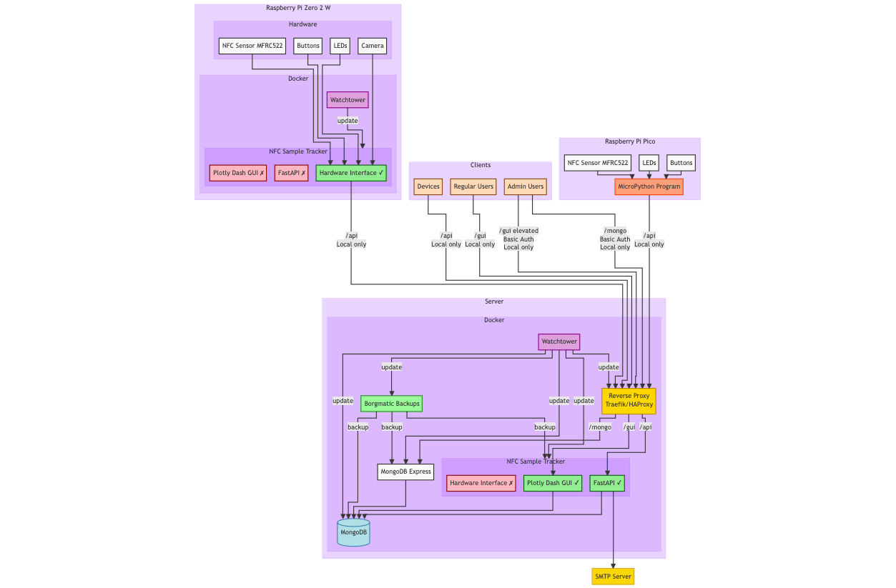
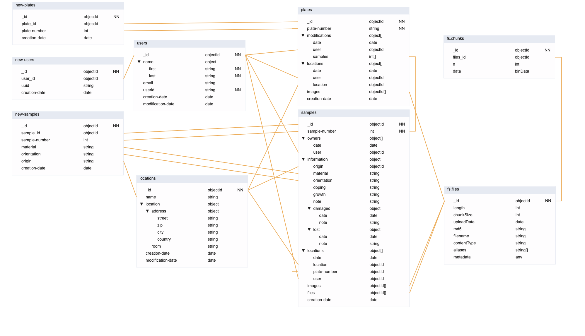

# nfc-sample-tracker

NFC sample tracking using NTAG 21X NFC tags


## Datasheets

- https://www.nxp.com/docs/en/data-sheet/MFRC522.pdf (https://web.archive.org/web/20240404075504/https://www.nxp.com/docs/en/data-sheet/MFRC522.pdf)
- https://www.nxp.com/docs/en/data-sheet/NTAG213_215_216.pdf (https://web.archive.org/web/20240404041534/https://www.nxp.com/docs/en/data-sheet/NTAG213_215_216.pdf)

## Install

### Native Raspberry Pi

```bash
sudo apt update && sudo apt upgrade
sudo apt install git ufw python3-pip
sudo raspi-config # enable spi
git clone https://github.com/lucasmchoi/nfc-sample-tracker.git
pip install -r requirements.txt
# if picamera2 is not installed run the following command
sudo apt install -y python3-picamera2

```

## System architecture



[Made using Mermaid](https://mermaid.js.org/)

[Mermaid GitHub](https://github.com/mermaid-js/mermaid)

## Database ER model



[Made using Mongo Modeler](https://www.mongomodeler.com/)

[Mongo Modeler GitHub](https://github.com/Lemoncode/mongo-modeler)

## License

Copyright © 2024 [Luca Choi](https://www.github.com/lucasmchoi)
This work is licensed under [AGPL v3](/LICENSE)

## Third-Party Requirements

- [Python](https://www.python.org) (PSF LICENSE AGREEMENT)
- [Pip](https://pypi.org/)

- [picamera2](https://github.com/RaspberryPi/picamera2) ([BSD 2-Clause License](LICENSES/picamera2-LICENSE.txt))
- [rpi-lgpio](https://github.com/waveform80/rpi-lgpio) ([MIT License](LICENSES/rpi-lgpio-LICENSE.txt))
- [pi-rc522](https://github.com/kevinvalk/pi-rc522) ([MIT License](LICENSES/pi-rc522-LICENSE.txt))
- [ndeflib](https://github.com/nfcpy/ndeflib) ([ISC License](LICENSES/ndeflib-LICENSE.txt))
- [pillow](https://github.com/python-pillow/Pillow) ([HPND License](LICENSES/pillow-LICENSE.txt))
- [pymongo](https://github.com/mongodb/mongo-python-driver) ([Apache License 2.0](LICENSES/pymongo-LICENSE.txt))
- [fastapi](https://github.com/tiangolo/fastapi) ([MIT License](LICENSES/fastapi-LICENSE.txt))
- [motor](https://github.com/mongodb/motor) ([Apache License 2.0](LICENSES/motor-LICENSE.txt))
- [pydantic](https://github.com/pydantic/pydantic) ([MIT License](LICENSES/pydantic-LICENSE.txt))
- [email-validator](https://github.com/JoshData/python-email-validator) ([Unlicense](LICENSES/email-validator-LICENSE.txt))
- [typing-extensions](https://github.com/python/typing_extensions) ([PSF License](LICENSES/typing-extensions-LICENSE.txt))
- [pandas](https://github.com/pandas-dev/pandas) ([BSD 3-Clause License](LICENSES/pandas-LICENSE.txt))
- [dash](https://github.com/plotly/dash) ([MIT License](LICENSES/dash-LICENSE.txt))
- [dash-bootstrap-components](https://github.com/facultyai/dash-bootstrap-components/) ([Apache License 2.0](LICENSES/dash-bootstrap-components-LICENSE.txt))
